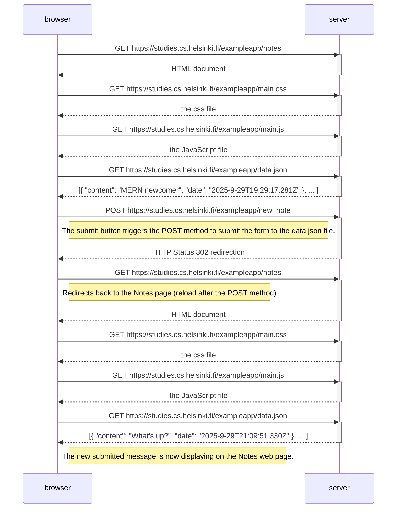

```mermaid
    sequenceDiagram
        participant browser
        participant server

        browser->>server: GET https://studies.cs.helsinki.fi/exampleapp/notes
        activate server
        server-->>browser: HTML document
        deactivate server

        browser->>server: GET https://studies.cs.helsinki.fi/exampleapp/main.css
        activate server
        server-->>browser: the css file
        deactivate server

        browser->>server: GET https://studies.cs.helsinki.fi/exampleapp/main.js
        activate server
        server-->>browser: the JavaScript file
        deactivate server

        browser->>server: GET https://studies.cs.helsinki.fi/exampleapp/data.json
        activate server
        server-->>browser: [{ "content": "MERN newcomer", "date": "2025-9-29T19:29:17.281Z" }, ... ]
        deactivate server

        browser->>server: POST https://studies.cs.helsinki.fi/exampleapp/new_note
        activate server
        Note right of browser: The submit button triggers the POST method to submit the form to the data.json file.
        server-->>browser: HTTP Status 302 redirection
        deactivate server

        browser->>server: GET https://studies.cs.helsinki.fi/exampleapp/notes
        activate server
        Note right of browser: Redirects back to the Notes page (reload after the POST method)
        server-->>browser: HTML document
        deactivate server

        browser->>server: GET https://studies.cs.helsinki.fi/exampleapp/main.css
        activate server
        server-->>browser: the css file
        deactivate server

        browser->>server: GET https://studies.cs.helsinki.fi/exampleapp/main.js
        activate server
        server-->>browser: the JavaScript file
        deactivate server

        browser->>server: GET https://studies.cs.helsinki.fi/exampleapp/data.json
        activate server
        server-->>browser: [{ "content": "What's up?", "date": "2025-9-29T21:09:51.330Z" }, ... ]
        deactivate server
        Note right of browser: The new submitted message is now displaying on the Notes web page.
```